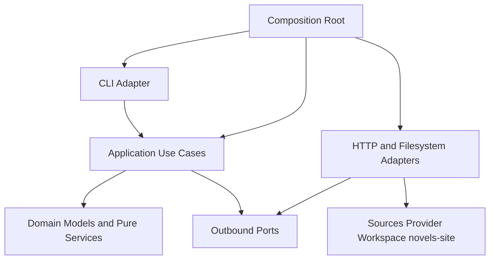

# Application Design consolidado

## 1. Resultado

O `novel-translator` será uma CLI Python organizada como arquitetura hexagonal leve. Quatro casos de uso explícitos coordenam serviços puros e outbound ports; adapters de filesystem e HTTP ficam nas bordas. O desenho mantém tradução, histórico técnico, aprovação editorial e exportação como responsabilidades separadas.

Documentos detalhados consolidados por este artefato:

- `components.md`: catálogo e responsabilidades;
- `component-methods.md`: assinaturas, tipos e erros;
- `services.md`: orquestração dos casos de uso;
- `component-dependency.md`: matriz, comunicação e fluxos.

## 2. Decisões aprovadas

| Tema | Decisão | Consequência |
|---|---|---|
| Arquitetura | Hexagonal leve | Núcleo independente de CLI, HTTP e filesystem. |
| Casos de uso | `TranslateChapter`, `ApproveDraft`, `ExportDraft`, `InspectRun` | Uma operação da CLI por caso de uso. |
| Contratos | Commands/queries e modelos tipados, preferencialmente imutáveis | Formatos externos são convertidos nas bordas. |
| Erros | Outcomes para decisões de negócio; exceções tipadas para falhas técnicas | CLI centraliza mensagens e exit codes. |
| Run lifecycle | Caso de uso coordena; `RunRepository` garante operações atômicas | Sem workflow engine adicional. |
| Chunking | Sequencial e determinístico | Continuidade e auditoria têm prioridade sobre paralelismo. |
| Adapters | Registries/factories explícitas por mapping | Extensível sem descoberta dinâmica. |
| Editorial | Aprovação/exportação append-only; draft atual como ponteiro atômico | Histórico preservado e projeção simples. |

## 3. Estrutura lógica



### Alternativa textual

O composition root monta CLI, casos de uso e adapters. A CLI chama a camada de aplicação. A aplicação usa domínio e ports. Adapters implementam os ports e acessam os sistemas externos. Dependências nunca retornam das camadas internas para as bordas.

## 4. Catálogo consolidado

### Entrada e aplicação

| Componente | Responsabilidade |
|---|---|
| `CliAdapter` | Parsing, interatividade, apresentação e exit codes. |
| `CompositionRoot` | Wiring explícito de configuração, registries, adapters e casos de uso. |
| `TranslateChapter` | Orquestrar a produção auditável do draft. |
| `ApproveDraft` | Registrar aprovação do hash exato. |
| `ExportDraft` | Validar e escrever exportação segura. |
| `InspectRun` | Consultar histórico e projeções sem mutação. |

### Núcleo e ports

| Componente | Responsabilidade |
|---|---|
| `ConfigurationService` e `SecretProvider` | Configuração tipada e segredo fora de artefatos. |
| `NovelDefinitionService` | Bible e manifesto estritos e separados. |
| `SourceAcquisitionService` / `SourceReader` | Adquirir fonte com proveniência sem trocar identidade canônica. |
| `TranslationContextBuilder` | Contexto determinístico derivado da bible. |
| `ChapterSegmenter` | Divisão, cobertura, ordem e recomposição. |
| `PromptBuilder` | Prompt versionado por segmento. |
| `TranslationGateway` | Contrato de LLM independente de provider. |
| `RetryExecutor` | Retry limitado de falhas transitórias. |
| `RunRepository` | Runs imutáveis, snapshots e `run.json`. |
| `ApprovalStore` | Eventos editoriais append-only. |
| `CurrentDraftStore` | Projeção mutável por capítulo. |
| `NovelSiteExporter` / `SafeFileWriter` | Plano de exportação, confinamento, colisões e escrita segura. |

### Adapters da v1

`LocalFileSourceReader`, `KakuyomuSourceReader`, `OpenAICompatibleGateway`, `FileSystemRunRepository`, `FileApprovalStore`, `FileCurrentDraftStore`, `AtomicFileWriter`, `SystemClock`, `UuidRunIdGenerator` e `TerminalProgressReporter`.

## 5. Contratos principais

```python
class TranslateChapter:
    def execute(self, command: TranslateCommand) -> TranslationOutcome: ...

class ApproveDraft:
    def execute(self, command: ApproveCommand) -> ApprovalOutcome: ...

class ExportDraft:
    def execute(self, command: ExportCommand) -> ExportOutcome: ...

class InspectRun:
    def execute(self, query: InspectQuery) -> RunView: ...

class TranslationGateway(Protocol):
    def translate(self, request: TranslationRequest) -> TranslationResponse: ...

class RunRepository(Protocol):
    def create(self, seed: RunSeed) -> RunRecord: ...
    def append_snapshot(self, run_id: str, snapshot: Snapshot) -> ArtifactRef: ...
    def transition(self, run_id: str, transition: RunTransition) -> RunRecord: ...
    def complete(self, run_id: str, draft: Draft, summary: RunSummary) -> RunRecord: ...
    def fail(self, run_id: str, failure: FailureRecord) -> RunRecord: ...
```

Detalhes de todos os contratos constam em `component-methods.md`. Tipos de bibliotecas de CLI, schema, HTTP e YAML não atravessam essas interfaces.

## 6. Pipeline de tradução

1. Validar command, configuração e bible.
2. Criar run único antes de efeitos externos relevantes.
3. Adquirir e preservar fonte/proveniência.
4. Construir contexto e plano de segmentos.
5. Traduzir segmentos sequencialmente, persistindo prompt, request sanitizado, tentativas, resposta e resultado.
6. Recompor e validar o draft.
7. Concluir `run.json` e depois atualizar o ponteiro atual.

Falhas após a criação do run levam a `failed` ou `interrupted` e preservam artefatos confirmados. Um resultado parcial nunca recebe estado `draft_completed`.

## 7. Pipeline editorial e exportação

1. Ler o draft concluído e recalcular seu hash.
2. Exigir `ApprovalEvent` com o mesmo `run_id` e hash.
3. Quando permitido, obter autorização explícita pela CLI e registrar aprovação antes da escrita.
4. Validar manifesto, capa, volume e contrato do site.
5. Criar um `ExportPlan` completo e sem efeitos.
6. Validar confinamento e colisões para todos os destinos.
7. Gravar temporários, promover arquivos autorizados e verificar hashes.
8. Acrescentar `ExportEvent`; não executar Git, build ou deployment.

## 8. Estado e persistência

### Run técnico

Estados: `started`, `translating`, `draft_completed`, `failed` e `interrupted`. Transições são monotônicas e estados finais não retornam a estados ativos.

### Editorial

`ApprovalEvent` e `ExportEvent` são append-only. Aprovação anterior permanece no histórico, mas deixa de ser válida se o draft atual tiver outro hash.

### Projeção atual

O ponteiro `novel/chapter -> run_id` é mutável e atômico, mas vive fora do run. Sua falha não modifica os artefatos imutáveis.

## 9. Modelo de falhas

- Decisões esperadas, como aprovação ou confirmação de colisão, são outcomes.
- Configuração inválida, integração, persistência e integridade usam exceções tipadas.
- Somente falhas classificadas como transitórias são repetidas.
- A CLI converte categorias em mensagens sanitizadas e exit codes estáveis.
- Segredos não integram commands serializáveis, snapshots, logs ou exceções apresentadas.

## 10. Design para testabilidade

- HTTP, filesystem, relógio, IDs, provider e terminal são substituíveis.
- Transformações de contexto, chunking, prompt, volume, hash e plano de exportação são puras sempre que possível.
- Registries são mappings explícitos testáveis.
- Serviços recebem dependências por composição; não há singletons ocultos nem inheritance trees.
- PBT parcial será detalhado em Functional/NFR Design com Hypothesis para round-trips, invariantes e geradores de domínio.

## 11. Rastreabilidade de requisitos

| Grupo | Componentes responsáveis |
|---|---|
| FR-CLI | `CliAdapter`, quatro casos de uso, `ConfigurationService` |
| FR-BIB | `NovelDefinitionService`, `TranslationContextBuilder` |
| FR-ING | `SourceAcquisitionService`, readers local/Kakuyomu |
| FR-TRN | `PromptBuilder`, `ChapterSegmenter`, gateway, retry, `TranslateChapter` |
| FR-RUN | `RunRepository`, `CurrentDraftStore`, `InspectRun` |
| FR-APR | `ApproveDraft`, `ApprovalStore`, `DraftIntegrityService` |
| FR-EDT/FR-EXP | `ExportDraft`, `NovelSiteExporter`, `SafeFileWriter` |
| NFR-001/007 | `Path`, UTF-8 explícito e adapters portáveis |
| NFR-002/003/009 | ports, composição e separação de I/O |
| NFR-004/006 | `ProgressReporter`, sanitização e segredo fora dos modelos |
| NFR-005 | repositories e writer atômicos |
| NFR-010 | serviços puros e contratos serializáveis preparados para Hypothesis |
| NFR-011/012 | código futuro em inglês; documentação presente em português |

As 19 histórias permanecem cobertas pelos quatro casos de uso e seus colaboradores conforme as matrizes dos documentos detalhados.

### Matriz explícita dos 70 identificadores

| Responsável primário | Identificadores rastreados |
|---|---|
| CLI e configuração | FR-CLI-001, FR-CLI-002, FR-CLI-003, FR-CLI-004, NFR-004, NFR-006 |
| Bible e manifesto | FR-BIB-001, FR-BIB-002, FR-BIB-003, FR-BIB-004, FR-EDT-001, FR-EDT-002, FR-EDT-003 |
| Ingestão | FR-ING-001, FR-ING-002, FR-ING-003, FR-ING-004 |
| Pipeline de tradução | FR-TRN-001, FR-TRN-002, FR-TRN-003, FR-TRN-004, FR-TRN-005, FR-TRN-006, NFR-003, NFR-008 |
| Workspace e consulta | FR-RUN-001, FR-RUN-002, FR-RUN-003, FR-RUN-004, FR-RUN-005, NFR-005 |
| Aprovação | FR-APR-001, FR-APR-002, FR-APR-003 |
| Exportação | FR-EXP-001, FR-EXP-002, FR-EXP-003, FR-EXP-004, FR-EXP-005, FR-EXP-006, FR-EXP-007 |
| Qualidades transversais | NFR-001, NFR-002, NFR-007, NFR-009, NFR-010, NFR-011, NFR-012 |
| Cenários | SCN-001, SCN-002, SCN-003, SCN-004, SCN-005 |
| Critérios de aceite | AC-001, AC-002, AC-003, AC-004, AC-005, AC-006, AC-007, AC-008, AC-009, AC-010, AC-011, AC-012, AC-013, AC-014, AC-015, AC-016, AC-017 |

Cada identificador possui um responsável primário; dependências secundárias constam nas matrizes de componentes e histórias. A contagem validada é 36 FR, 12 NFR, 5 SCN e 17 AC, totalizando 70.

## 12. Alternativas rejeitadas nesta etapa

- Facade único: concentraria razões de mudança e dependências demais.
- Modelos externos compartilhados: vazariam bibliotecas para o núcleo.
- Workflow engine: complexidade sem necessidade na CLI v1.
- Chunking paralelo: prejudicaria continuidade determinística sem requisito de latência.
- Plugin discovery: mapping explícito cobre a substituição exigida com menos complexidade.
- Event sourcing completo: eventos editoriais precisam de histórico, mas runs já são registros imutáveis; não há valor em reconstruir toda a aplicação por eventos.

## 13. Validação de conteúdo

- O Mermaid usa IDs alfanuméricos, nós declarados e labels entre aspas.
- Há alternativa textual ao diagrama.
- Blocos Python representam assinaturas válidas de alto nível.
- Markdown, tabelas e referências foram revisados.

## 14. Extension Compliance

| Extensão | Resultado | Justificativa |
|---|---|---|
| Resiliency Baseline | N/A | Desabilitada em `aidlc-state.md`. |
| Security Baseline | N/A | Desabilitada; NFR-006 continua atendido pelo design. |
| Property-Based Testing parcial | N/A nesta etapa | Nenhuma regra parcial é imposta a Application Design; o design isola os alvos das etapas aplicáveis. |

Não há achado bloqueante de extensão.
