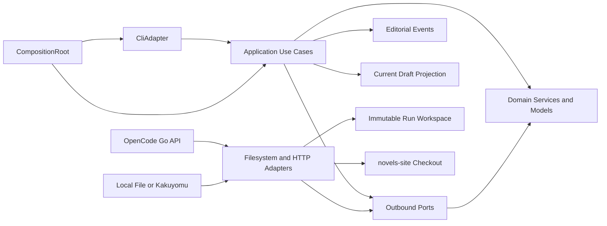
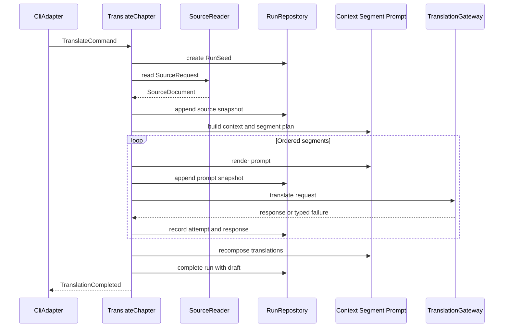
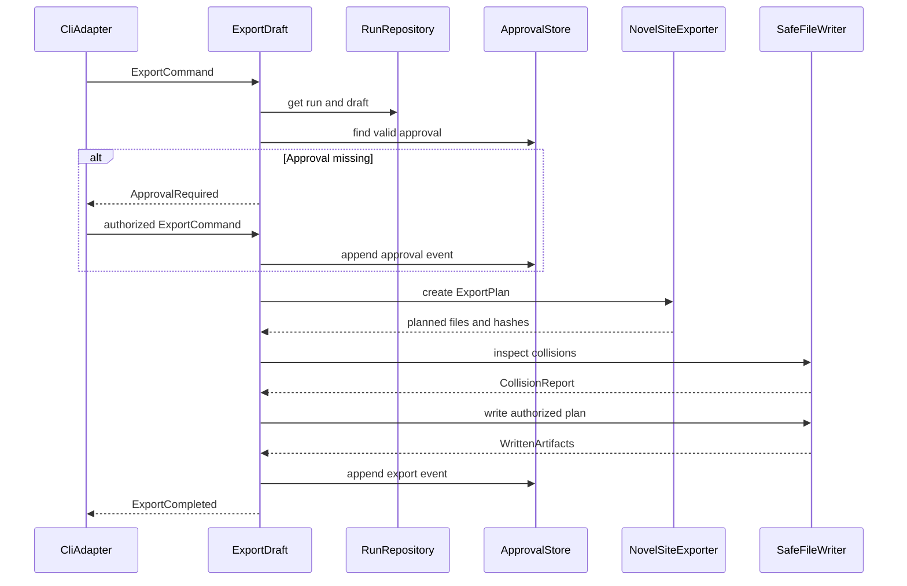

# Dependências e comunicação entre componentes

## 1. Regra de direção

As dependências de código apontam para dentro: adapters dependem dos ports e tipos internos; casos de uso dependem de serviços puros e ports; o núcleo não importa CLI, HTTP, filesystem ou implementações concretas. O `CompositionRoot` é o único ponto que conhece todas as implementações.

## 2. Diagrama de componentes



### Alternativa textual

1. `CliAdapter` chama um caso de uso.
2. Casos de uso usam modelos/serviços puros e outbound ports.
3. Adapters de HTTP e filesystem implementam os ports.
4. Adapters conectam fontes, OpenCode Go, workspace e checkout de destino.
5. Eventos editoriais e ponteiro de draft atual permanecem separados dos runs imutáveis.
6. `CompositionRoot` monta todas as dependências sem participar dos fluxos.

## 3. Matriz de dependências lógicas

Legenda: `U` usa contrato; `O` orquestra; `I` implementa port; `-` sem dependência direta.

| Componente | Novel definitions | Source acquisition | Context/prompt/chunking | LLM gateway | Run repository | Approval store | Current draft | Exporter/writer |
|---|---:|---:|---:|---:|---:|---:|---:|---:|
| `TranslateChapter` | U | O | O | O | O | - | U | - |
| `ApproveDraft` | - | - | - | - | U | O | - | - |
| `ExportDraft` | U | - | - | - | U | O | - | O |
| `InspectRun` | - | - | - | - | U | U | U | - |
| Filesystem adapters | I | I | - | - | I | I | I | I |
| HTTP adapters | - | I | - | I | - | - | - | - |

Não existem chamadas diretas entre adapters. Um adapter pode utilizar um port técnico menor, como `HttpClient` ou `SafeFileWriter`, desde que o wiring ocorra no composition root.

## 4. Dependências dos casos de uso

### `TranslateChapter`

```text
TranslateChapter
  -> NovelDefinitionService
  -> SourceAcquisitionService -> SourceReader
  -> TranslationContextBuilder
  -> ChapterSegmenter
  -> PromptBuilder
  -> TranslationGatewayRegistry -> TranslationGateway
  -> RetryExecutor
  -> RunRepository
  -> CurrentDraftStore
  -> Clock, RunIdGenerator, ContentHasher, ProgressReporter
```

### `ApproveDraft`

```text
ApproveDraft
  -> RunRepository
  -> DraftIntegrityService
  -> ApprovalStore
  -> Clock, EventIdGenerator, ProgressReporter
```

### `ExportDraft`

```text
ExportDraft
  -> RunRepository
  -> DraftIntegrityService
  -> ApprovalStore
  -> NovelDefinitionService
  -> VolumeResolver
  -> NovelSiteExporter
  -> SafeFileWriter
  -> Clock, ProgressReporter
```

### `InspectRun`

```text
InspectRun
  -> RunRepository
  -> CurrentDraftStore
  -> ApprovalStore
```

## 5. Fluxo de dados da tradução



### Alternativa textual

A CLI entrega um command. O caso de uso cria o run antes de adquirir a fonte, preserva cada transformação, traduz segmentos sequencialmente, recompõe o draft e só então conclui o run e retorna sucesso.

## 6. Fluxo de aprovação e exportação



### Alternativa textual

O serviço lê o draft, exige uma aprovação com hash correspondente, planeja todos os arquivos, verifica destino e colisões antes de qualquer escrita, grava com autorização explícita e acrescenta o evento de exportação.

## 7. Comunicação e consistência

| Relação | Padrão | Consistência |
|---|---|---|
| CLI -> caso de uso | chamada síncrona em processo | uma operação por invocação |
| Caso de uso -> serviço puro | chamada direta com tipos internos | determinística |
| Caso de uso -> port | chamada síncrona e tipada | falha explícita |
| Gateway -> provider | HTTP request/response | timeout e retries limitados |
| Run repository -> workspace | arquivos create-only e metadata atômica | monotônica por run |
| Approval store -> eventos | append-only | histórico preservado |
| Current draft -> projeção | substituição atômica | reconstruível a partir da escolha do operador |
| Exporter -> checkout | plano, inspeção e promoção | sem sobrescrita silenciosa |

## 8. Ciclos proibidos

- `domain/application -> CLI`;
- `domain/application -> adapter concreto`;
- `RunRepository -> ApprovalStore` ou o inverso;
- `SourceReader -> TranslationGateway`;
- `NovelSiteExporter -> RunRepository`;
- qualquer adapter coordenando um caso de uso.

## 9. Validação do Mermaid

- IDs usam apenas caracteres alfanuméricos.
- Todos os participantes e nós são declarados antes do uso.
- Labels potencialmente especiais estão entre aspas quando aplicável.
- `loop` e `alt` possuem encerramentos correspondentes.
- Cada diagrama possui alternativa textual.

## 10. Extension Compliance

- Property-Based Testing parcial: N/A para dependências; separação de serviços puros e I/O permite testes de invariantes posteriores.
- Security e Resiliency: desabilitadas, sem regras adicionais aplicadas.
