# Plano de Execução

## Resumo da análise detalhada

### Escopo

- **Tipo de projeto**: greenfield, aplicação CLI local em Python.
- **Objetivo principal**: traduzir capítulos de web novels do japonês para o inglês com contexto por novel, histórico auditável, aprovação explícita e exportação segura para `novels-site`.
- **Escopo funcional**: configuração, schemas YAML, ingestão local e Kakuyomu, contexto, provider de LLM, chunking, retries, workspace imutável, consulta, aprovação e exportação Markdown.
- **Escopo externo**: API HTTP compatível com OpenAI para OpenCode Go, páginas do Kakuyomu e contrato de conteúdo do `novels-site`.

### Avaliação de impacto

- **Mudanças voltadas ao usuário**: sim; toda a CLI e suas jornadas são novas.
- **Mudanças estruturais**: sim; são necessárias fronteiras claras entre aplicação, domínio, adapters e persistência local.
- **Mudanças em modelos de dados**: sim; translation bible, manifesto editorial, configuração, execução, estados, eventos de aprovação, metadados de origem e exportação.
- **Mudanças de API/contrato**: sim; contrato interno de provider, adapter HTTP OpenAI-compatible, extrator Kakuyomu e escritor para o schema do `novels-site`.
- **Impacto em NFRs**: relevante; portabilidade, Unicode, proteção de segredos, auditabilidade, escrita recuperável, testabilidade, PBT parcial e idiomas dos artefatos.
- **Infraestrutura**: não; a v1 é local, não publica, não executa Git e não provisiona recursos de nuvem.

### Áreas de componentes previstas

1. Interface CLI e orquestração de casos de uso.
2. Configuração, segredos e validação de schemas.
3. Ingestão de arquivo e adapter Kakuyomu.
4. Translation bible, contexto, prompt e chunking.
5. Contrato de LLM e adapter OpenCode Go.
6. Workspace, `run.json`, snapshots, hashes e consulta.
7. Aprovação e integridade por hash.
8. Manifesto editorial e exportador `novels-site`.
9. Testes por exemplos, propriedades e integração.

### Avaliação de risco

- **Nível**: médio.
- **Justificativa**: não há migração nem produção existente, mas há várias fronteiras externas, regras de integridade, conteúdo Unicode e risco de escrita incorreta em outro checkout.
- **Complexidade de rollback**: moderada durante desenvolvimento; artefatos imutáveis e escrita segura reduzem perda de dados.
- **Complexidade de testes**: complexa; exige doubles de HTTP/filesystem/relógio/provider, fixtures de páginas, contratos de exportação, Windows/macOS e Hypothesis.
- **Redutores de risco**: design de componentes, decomposição em unidades, contratos explícitos, PBT parcial e gates de aprovação.

## Restrições transversais

- O código-fonte será escrito em inglês, incluindo identificadores e, quando fizerem sentido, comentários e docstrings.
- A documentação do projeto será escrita em português, preservando termos técnicos canônicos em inglês quando necessário.
- Segredos não poderão aparecer em logs ou artefatos persistidos.
- PBT-02, PBT-03, PBT-07, PBT-08 e PBT-09 são bloqueantes nas etapas técnicas aplicáveis.
- Código da aplicação ficará na raiz do workspace; `aidlc-docs/` conterá somente documentação.

## Visualização do workflow

```mermaid
flowchart TD
    Start(["Solicitação aprovada"])

    subgraph INCEPTION["INCEPTION"]
        WD["Workspace Detection<br/><b>CONCLUÍDO</b>"]
        RE["Reverse Engineering<br/><b>SKIP</b>"]
        RA["Requirements Analysis<br/><b>CONCLUÍDO</b>"]
        US["User Stories<br/><b>CONCLUÍDO</b>"]
        WP["Workflow Planning<br/><b>EM REVISÃO</b>"]
        AD["Application Design<br/><b>EXECUTAR</b>"]
        UG["Units Generation<br/><b>EXECUTAR</b>"]
    end

    subgraph CONSTRUCTION["CONSTRUCTION"]
        FD["Functional Design<br/><b>EXECUTAR</b>"]
        NFRA["NFR Requirements<br/><b>EXECUTAR</b>"]
        NFRD["NFR Design<br/><b>EXECUTAR</b>"]
        ID["Infrastructure Design<br/><b>SKIP</b>"]
        CG["Code Generation<br/><b>EXECUTAR</b>"]
        BT["Build and Test<br/><b>EXECUTAR</b>"]
    end

    subgraph OPERATIONS["OPERATIONS"]
        OPS["Operations<br/><b>PLACEHOLDER</b>"]
    end

    End(["Workflow concluído"])

    Start --> WD
    WD --> RE
    RE --> RA
    RA --> US
    US --> WP
    WP --> AD
    AD --> UG
    UG --> FD
    FD --> NFRA
    NFRA --> NFRD
    NFRD --> ID
    ID --> CG
    CG --> BT
    BT --> OPS
    OPS --> End

    style WD fill:#4CAF50,stroke:#1B5E20,stroke-width:3px,color:#fff
    style RA fill:#4CAF50,stroke:#1B5E20,stroke-width:3px,color:#fff
    style US fill:#4CAF50,stroke:#1B5E20,stroke-width:3px,color:#fff
    style WP fill:#4CAF50,stroke:#1B5E20,stroke-width:3px,color:#fff
    style CG fill:#4CAF50,stroke:#1B5E20,stroke-width:3px,color:#fff
    style BT fill:#4CAF50,stroke:#1B5E20,stroke-width:3px,color:#fff
    style AD fill:#FFA726,stroke:#E65100,stroke-width:3px,stroke-dasharray:5 5,color:#000
    style UG fill:#FFA726,stroke:#E65100,stroke-width:3px,stroke-dasharray:5 5,color:#000
    style FD fill:#FFA726,stroke:#E65100,stroke-width:3px,stroke-dasharray:5 5,color:#000
    style NFRA fill:#FFA726,stroke:#E65100,stroke-width:3px,stroke-dasharray:5 5,color:#000
    style NFRD fill:#FFA726,stroke:#E65100,stroke-width:3px,stroke-dasharray:5 5,color:#000
    style RE fill:#BDBDBD,stroke:#424242,stroke-width:2px,stroke-dasharray:5 5,color:#000
    style ID fill:#BDBDBD,stroke:#424242,stroke-width:2px,stroke-dasharray:5 5,color:#000
    style OPS fill:#BDBDBD,stroke:#424242,stroke-width:2px,stroke-dasharray:5 5,color:#000
    style Start fill:#CE93D8,stroke:#6A1B9A,stroke-width:3px,color:#000
    style End fill:#CE93D8,stroke:#6A1B9A,stroke-width:3px,color:#000
    style INCEPTION fill:#BBDEFB,stroke:#1565C0,stroke-width:3px,color:#000
    style CONSTRUCTION fill:#C8E6C9,stroke:#2E7D32,stroke-width:3px,color:#000
    style OPERATIONS fill:#FFF59D,stroke:#F57F17,stroke-width:3px,color:#000
    linkStyle default stroke:#333,stroke-width:2px
```

### Alternativa textual

1. Workspace Detection - concluído.
2. Reverse Engineering - skip, pois o projeto é greenfield.
3. Requirements Analysis - concluído.
4. User Stories - concluído.
5. Workflow Planning - em revisão.
6. Application Design - executar.
7. Units Generation - executar.
8. Functional Design - executar por unidade aplicável.
9. NFR Requirements - executar por unidade aplicável.
10. NFR Design - executar por unidade aplicável.
11. Infrastructure Design - skip, pois não há infraestrutura ou deployment na v1.
12. Code Generation - executar por unidade.
13. Build and Test - executar após todas as unidades.
14. Operations - placeholder, sem execução na v1.

## Fases a executar

### INCEPTION

- [x] Workspace Detection - concluído.
- [x] Reverse Engineering - skip concluído; workspace greenfield sem código existente.
- [x] Requirements Analysis - concluído.
- [x] User Stories - concluído.
- [x] Workflow Planning - plano produzido e aprovado em 2026-08-30T16:17:22Z.
- [x] Application Design - **CONCLUÍDO e aprovado em 2026-08-30T21:55:14Z**.
  - **Razão**: novos componentes, contratos, adapters, métodos, regras e dependências precisam ser definidos antes da decomposição.
- [ ] Units Generation - **EXECUTAR, profundidade abrangente**.
  - **Razão**: o sistema contém múltiplos domínios, schemas, integrações e máquinas de estado que exigem unidades e dependências explícitas.

### CONSTRUCTION

- [ ] Functional Design - **EXECUTAR por unidade aplicável, profundidade adaptativa**.
  - **Razão**: existem novos modelos, schemas, chunking, precedência de volume, estados, aprovação por hash e regras de escrita.
- [ ] NFR Requirements - **EXECUTAR por unidade aplicável, profundidade abrangente**.
  - **Razão**: tech stack ainda precisa ser fechado e há requisitos de portabilidade, Unicode, segurança mínima, desempenho, testabilidade, PBT e idioma.
- [ ] NFR Design - **EXECUTAR por unidade aplicável, profundidade abrangente**.
  - **Razão**: os padrões para atomicidade, adapters, observabilidade, segredos, retries e testes precisam ser incorporados ao design.
- [ ] Infrastructure Design - **SKIP**.
  - **Razão**: a v1 é uma CLI local sem cloud, serviço hospedado, banco remoto, deployment ou publicação automática.
- [ ] Code Generation - **EXECUTAR por unidade, sempre obrigatório**.
  - **Razão**: implementar código Python em inglês, testes e configuração conforme os designs aprovados.
- [ ] Build and Test - **EXECUTAR, sempre obrigatório**.
  - **Razão**: validar unidades, integrações, contratos, propriedades, portabilidade e fluxos ponta a ponta; instruções e relatórios serão em português.

### OPERATIONS

- [ ] Operations - **PLACEHOLDER**.
  - **Razão**: deployment e monitoramento operacional não fazem parte do workflow atual nem do escopo da v1.

## Sequência recomendada

1. Application Design define componentes, contratos e dependências.
2. Units Generation decompõe o design e mapeia as 19 histórias.
3. Para cada unidade, executar Functional Design, NFR Requirements e NFR Design conforme aplicabilidade.
4. Para cada unidade aprovada, planejar e gerar código e testes.
5. Após todas as unidades, produzir e validar as instruções integradas de Build and Test.

Não há sequência de atualização de packages brownfield, pois nenhum package de aplicação existe ainda.

## Estimativa de execução

- **Etapas restantes recomendadas**: 7 categorias executáveis, além dos gates por unidade.
- **Etapa pulada**: Infrastructure Design.
- **Duração**: será estimada após Units Generation, quando limites e dependências das unidades estiverem aprovados; uma estimativa anterior seria especulativa.

## Critérios de sucesso

- Todos os 70 identificadores de requisitos permanecem rastreados até design, unidades, código e testes.
- As 19 histórias são atribuídas a unidades implementáveis sem lacunas ou duplicação de responsabilidade.
- Código, identificadores, comentários e docstrings aplicáveis estão em inglês.
- Documentação do projeto está em português.
- Todos os artefatos obrigatórios das etapas selecionadas são criados e aprovados.
- Testes por exemplos cobrem cenários críticos e Hypothesis cobre as propriedades PBT habilitadas.
- A CLI funciona em Windows e macOS e preserva Unicode.
- Nenhum segredo é persistido e nenhuma exportação sobrescreve ou publica silenciosamente.

## Extension Compliance

| Extensão | Estado | Conformidade nesta etapa |
|---|---|---|
| Resiliency Baseline | Desabilitada | Não aplicada; skip registrado no audit log. |
| Security Baseline | Desabilitada | Não aplicada; skip registrado no audit log. |
| Property-Based Testing | Conforme | PBT-02, PBT-03, PBT-07, PBT-08 e PBT-09 foram encaminhadas às etapas de Functional Design, NFR Requirements, NFR Design, Code Generation e Build and Test. Não há achado bloqueante no planejamento. |

## Validação de conteúdo

- Mermaid usa apenas IDs alfanuméricos e referências declaradas.
- Labels com formatação estão entre aspas e não contêm caracteres de escape inválidos.
- Fluxo, subgraphs e estilos possuem sintaxe balanceada.
- A alternativa textual está presente para leitores sem suporte a Mermaid.
- Markdown, tabelas e checkboxes foram verificados quanto à compatibilidade de parsing.
